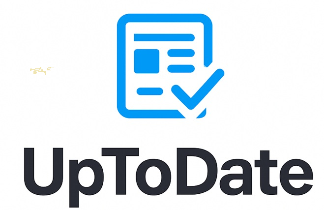

<p align="center">
  
</p>

<h1 align="center">UpToDate</h1>
<p align="center">A desktop news aggregator built with Python & customtkinter</p>

---

## Features

- **8 news categories** — General, Business, Entertainment, Health, Science, Sports, Technology + Favorites
- **Live search** per category (press Enter to filter)
- **Favorites** — save, view and delete articles; persisted locally as JSON
- **Async image loading** — article thumbnails load in the background without blocking the UI
- **Clean headlines** — source suffix and excess whitespace stripped automatically

## Tech Stack

| | |
|---|---|
| GUI | [customtkinter](https://github.com/TomSchimansky/CustomTkinter) |
| News data | [NewsAPI](https://newsapi.org/) |
| HTTP | requests |
| Image processing | Pillow |
| HTML parsing | BeautifulSoup4 |
| Concurrency | `concurrent.futures.ThreadPoolExecutor` |

## Setup

### 1. Get a NewsAPI key
Sign up for free at [newsapi.org](https://newsapi.org/) — the free tier is sufficient.

### 2. Configure your API key
Copy `.env.example` to `.env` and paste your key:
```bash
cp .env.example .env
# then edit .env:
API_KEY=your_actual_key_here
```
The `.env` file is excluded from git and will never be committed.

### 3. Install dependencies
```bash
pip install -r requirements.txt
```

### 4. Run
```bash
python main.py
```

The app opens with a short loading screen while headlines are fetched, then shows the tabbed news view.

## Project structure

```
UpToDate/
├── main.py          # App entry point: NewsFrame widget, tab layout, loading screen
├── newsapi.py       # NewsAPI calls + headline cleaning
├── interface.py     # Helper functions (tab/category rendering, article filtering)
├── favorites.py     # Favorites persistence (JSON in ~/.news_app/)
├── logo.png         # App logo
├── photo.jpg        # Placeholder image for articles without a thumbnail
├── .env.example     # API key template
├── requirements.txt
└── .gitignore
```

## Notes

- Developed as a group project during a Data Analytics Bootcamp (Aug 2025).
- The free NewsAPI plan only works on `localhost` — no server deployment needed.
